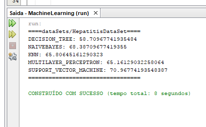

# MachineLearningElasticComponent

This project aims to be an easy and reusable way to use supervised machine learning techniques.

# How to use

First of all you'll need to import weka API and MachineLearningElasticComponent API to your project (both of them may be found [here](https://github.com/Lucasfrota/MachineLearningElasticComponent/tree/master/JARs)), once those API are inside your project you can access all of its functionalities. some of those functionalities are listed below.

## classifications

To generate a knowledge model it is required to choose your machine learning technique then you'll have to have an .arff file and specify its path in the constructor method just as the index of the predictive class( in case of your index is in the last position you don't have to declare it ).

```
ElasticClassifier iris = new ElasticClassifier(ElasticClassifier.Type.SUPPORT_VECTOR_MACHINE , "dataSets/iris");
```

Then if you want to classify a new register to obtain a prediction of its class you'll use the classifier method, its parameter is a List of Objects which has to contain the features of your new register

```
List<Object> features = Arrays.asList(5.1,3.5,1.4,0.2);
String irisClass = iris.classifier(features);
```

Now you have classified an unknown instance :) to know the given classification just print the result

```
System.out.println("Iris class: " + irisClass);
```

## Comparator

The comparator component is very useful if you need to compare the accuracy of multiples Techniques give to a specific dataSet. To create a Comparator you'll need first of all to specify the dataset you want to test, as shown below

```
Comparator comp = new Comparator("dataSets/iris");
```

If you simply want to show the accuracy of each technique use

```
comp.printBestType();
```

If you need a method that returns the best technique you can use the method bestType()

```
String bestType = comp.bestType()
```

This command will show something like this



# ML Model serialization

To have the possibilite of using your ML Model in an Android App you may want to serialize it. To do so you'll only need your trained model and an instance of Serializer object, in the following lines we're saving the model called iris with the name "iris.model", but feel free to save your model without the .model extension
```
Serializer<ElasticClassifier> serializer = new Serializer<ElasticClassifier>();
serializer.SerializeObject(iris, "iris.model");
```

Now you just need to use this file on your Android Studio project as shown [here](https://github.com/Lucasfrota/AndroidMLModelDeserializer)

# How it works

All the artificial intelligence techniques used in this project was provided by Weka's API version 3.8. More information about weka may be found in [their website](https://www.cs.waikato.ac.nz/ml/weka/)

# Information about the data

* [Machine learning repository](http://archive.ics.uci.edu/ml/datasets.html) - More dataSets like HepatitisDataSet
* [Used dataSet](http://archive.ics.uci.edu/ml/datasets/Hepatitis) - More information specifically about the used dataSet
* [data](http://archive.ics.uci.edu/ml/machine-learning-databases/hepatitis/hepatitis.data) - The data itself may be found here
* the data of "plantas" dataset was collected from my backyard garden :)
